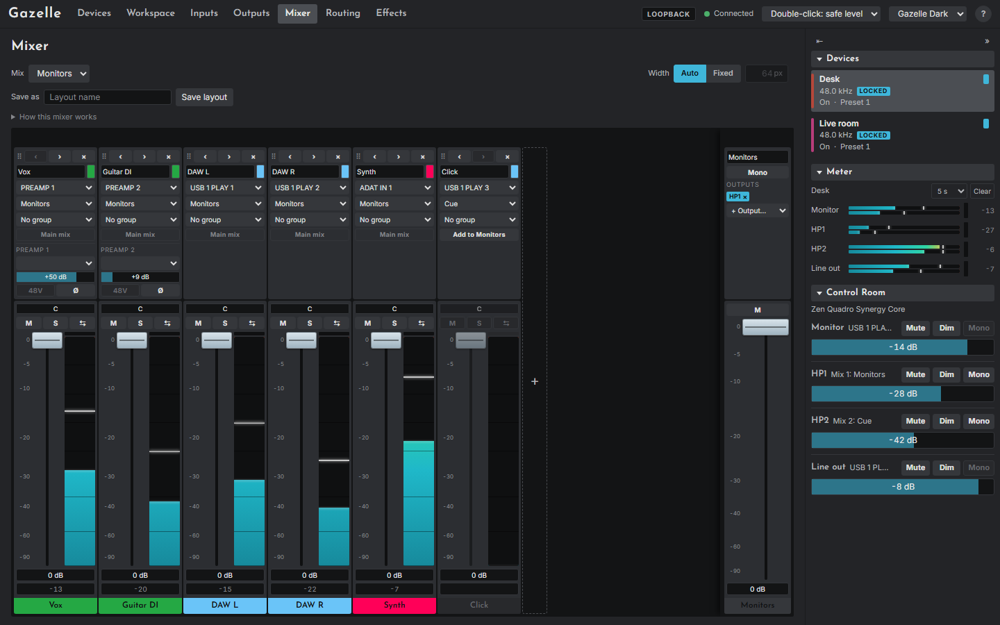

# About Gazelle

Gazelle is a control app for two Antelope Audio USB interfaces: the **Zen Quadro Synergy Core** and the **Zen Studio+**. It sets what the interfaces' own control software sets (preamps, 48V, the four internal mixes, routing, output levels, the clock, effects and the reverb) from one window, for every attached interface at once. It is also a small web server, so the same controls work from a browser on a phone or a second computer on your network, if you allow it.

## Why it exists

The vendor's software gives each interface its own panel application, so two interfaces mean two applications and a lot of switching. Gazelle was written by one person who owns both models and wanted something lighter and clearer:

- **One app for every device.** Each attached interface appears in the sidebar; a click switches the page to it. Cross-device *surfaces* put strips from both interfaces side by side.
- **A plain mixer.** Channels are named, coloured and grouped. You choose each channel's input, the mix it plays in and the other mixes it is sent to, and Gazelle does the routing that implies.
- **Nothing hidden.** Every page shows the last command it sent and its bytes. A *dry run* mode shows what would be sent without sending anything.
- **Small.** One executable of a few megabytes, per-user, no administrator rights, no background service of its own.

## What it is not

- **Not Antelope's software, and not endorsed by Antelope.** Gazelle was written independently from the protocol the devices speak, which was studied from the vendor's own software on the author's machine. No Antelope code, artwork or text is in it. See [Independence and trademarks](#independence-and-trademarks).
- **Not a firmware tool.** Gazelle never updates, flashes or otherwise writes firmware, and has no code that could.
- **Not a licence manager.** Effects and microphone emulations that your devices are not licensed for stay greyed out; Gazelle cannot unlock anything.
- **Not in the audio path.** Gazelle only sends settings. Audio flows through the interface as it always does; if Gazelle quits or crashes, the interface carries on with whatever it was last set to.

## How well it has been tested

This matters for software that controls equipment connected to speakers and headphones, so it is said plainly here and in full in the [Safety](02-safety.md) chapter.

Gazelle has been used on **one person's two interfaces**: one Zen Quadro Synergy Core and one Zen Studio+, on one Windows 11 PC. It has not been tried on any other unit, any other firmware, any other computer or any other operating system. It is new software, at version 1.0.0, with no published release yet.

Almost everything has an automated test against a built-in emulator of both devices (over a thousand tests across the server and the web app), and every command's bytes are checked against reference bytes generated from the vendor software's own command definitions. That proves Gazelle sends what it means to send. It does not prove what a real device does with it. On the real hardware, these have been driven and checked:

| Driven on the real devices | Which |
|---|---|
| Finding and opening both interfaces, reading their state and meters | Both |
| Mixer faders, mute and solo, read back from all four mixes | Both |
| Input and output metering, with signal | Quadro |
| Microphone emulation with an Edge Duo | Quadro |
| Front panel brightness | Quadro |
| Inserting and removing one effect, and one effect setting (a Guitar Amp switch) | Quadro |
| The effects meter report, with signal | Quadro |
| The Control Room output choice and the tray menu, by eye | Both |

Written, tested against the emulator, and **never yet tried on a real device**: device presets (save and recall), hard mute, DC coupling, the test oscillator, S/PDIF sample rate conversion, reordering effects or chains of several effects, every effect parameter except the one above, the Studio+ Equalizer, reverb settings, reverb sends and returns, Control Room mono and talkback, cross-device surfaces and digital cables in use, unplugging and replugging a device while Gazelle runs, Start on boot, the installer and the updater. Snapshot *recall* is deliberately not built at all.

If something behaves differently on your unit, it is most likely a difference nobody has seen yet, not your mistake. The [Troubleshooting](16-troubleshooting.md) chapter says how to report it.

## Independence and trademarks

Gazelle is independent software. It is not affiliated with, endorsed by, sponsored by or supported by Antelope Audio. Antelope Audio, Zen Quadro, Zen Studio, Synergy Core, Edge and the names of the effects and microphone models shown in the app are trademarks of their respective owners, and appear only to say which hardware and which device features Gazelle works with.

Gazelle is free software under the MIT licence and comes with no warranty of any kind. Using it may void or complicate support from the hardware's maker; ask them if that matters to you.

## About this manual

The manual describes Gazelle as the code stands at version 1.0.0 on Windows. The screenshots were taken from the running app against its built-in emulator (`--backend loopback`), so the device names are made up and the meters show a test pattern.

- [Safety](02-safety.md) comes before everything else. Please read it.
- [Getting started](03-getting-started.md) takes you from download to a first look.
- [Concepts](04-concepts.md) explains the devices' building blocks: inputs, mixes, routing, outputs, effects.
- Chapters 5 to 14 go through the app and each of its pages.
- [Troubleshooting](16-troubleshooting.md), the [command line and API](17-command-line-and-api.md) and the [glossary](18-glossary.md) are for reference.

A two-page [cheat sheet](../cheat-sheet.md) is printed separately, to keep beside the desk.
