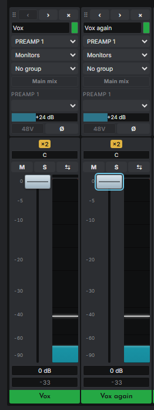

# Safety

Software that controls an audio interface can make it very loud, very suddenly. A fader, a gain, a route or a preset reaches your monitors and headphones as fast as the device can apply it, and a monitor amplifier or a pair of headphones does not know the change was a mistake. This chapter names the real risks, says what Gazelle does about each, and says what you can do.

Manufacturers' own manuals and apps rarely spell this out, and anyone who has worked with audio for long has a story about a burst of noise from equipment behaving badly, first-party software included. Gazelle is new, independently written and tested on one person's two units ([how well it has been tested](01-about.md#how-well-it-has-been-tested)), so it owes you more candour, not less.

## The short version

> **Warning.** Before you try anything new in Gazelle, turn your monitors and headphones down, and know where the physical way to silence them is.

1. **Start low.** Turn the monitor amplifier or powered speakers down, and take headphones off or turn their level down, whenever you try a page, a control or a feature for the first time.
2. **Know your physical mute.** The volume knob on your speakers or amplifier, their power switch, or the interface's own volume knob. Software can be slow or wrong at the moment you need it; a knob is not.
3. **Try it in dry run first.** Started with `--dry-run`, Gazelle sends nothing to the devices and shows the bytes it would have sent. With `--backend loopback` it talks to a built-in emulator and no hardware at all. See [Trying things safely](#trying-things-safely).
4. **Mind 48V.** Phantom power can damage ribbon microphones and some gear, and makes a thump when it switches. Gazelle asks twice before switching it on.
5. **Do not run the vendor's software against the same device at the same time.** Each program's view of the device goes stale, and a stale view can undo the other's changes.
6. **If something sounds wrong, silence first, investigate second.** Turn the speakers down or off, then use Gazelle's Mute or, on a Quadro, Hard mute.

## Sudden level jumps

**The risk.** A volume, a gain, a fader or a route changes, and the result reaches your monitors or headphones at full level: an output volume set to 0 dB (its maximum), a preamp gain pushed up (the Mic range goes to +65 dB), a mix fader brought to unity, or a source routed straight to an output, which bypasses every level control in between.

**Where it can happen in Gazelle, specifically:**

- **Clicking a bar or fader jumps to the point you clicked.** It does not nudge from where it was: a click near the top of a fader sets it near 0 dB at once.
- **Double-click on a level goes to a safe level, and Ctrl+click to unity.** A mixer fader resets to **-20 dB**; an output, Control Room or talkback volume to **-30 dB**; a reverb send (the Studio+'s Send or a Quadro reverb send) to **off**, so a double-click never adds reverb; the reverb level to -18 dB, the nearest it has; a Quadro reverb return to 20 steps below full. **Ctrl+click** (Cmd+click on a Mac keyboard) puts a level at **unity**, 0 dB or full for a return, wherever on the control you click. The header's **Double-click** menu can make double-click unity too, for this browser; a level's tooltip always says which it does. Gains reset to 0 dB, pans to centre. See the table in [Gestures](05-the-app.md#gestures).
- **Home and End jump to the ends.** On a mixer fader, Home is 0 dB; on an output volume, End is 0 dB.
- **The mouse wheel moves whatever is under the pointer**, one step per notch (1 dB on faders and volumes), and also steps drop-down menus. Scrolling the page with the pointer over a control changes that control. The menus where one notch would be disruptive ignore the wheel: clock source, sample rate, the driver's buffer size, adding an effect, and every menu that re-routes audio (a channel's input and main mix, a mix's **+ Output**, a port strip's **Route**).
- **Routing changes are immediate.** Choosing a channel's input, a mix's output or a routing cell sends the change as soon as you choose it. A source routed directly to an output plays at its full level with no fader in the way.
- **Device presets change many things at once.** A preset button on the Devices page recalls that preset on the device on a second, confirming click, and nobody has yet checked which settings a preset carries (it may include 48V and the clock).

**What Gazelle does.**

- **Nothing is sent unless you act.** Opening a page only reads from the device. No page writes to a device on its own.
- **Nothing is replayed.** If the connection to Gazelle's server drops, every control is disabled at once, and a change you made is never queued and sent later when it comes back. A drag sends the values it passes through at most as fast as the device takes them, and always the value it lands on.
- **Mute and Hard mute.** Every output has a Mute button, on the Outputs page and in the Control Room panel. On a Quadro, **Hard mute** on the Outputs page mutes every output at once.

**What you should do.** Keep monitors and headphones low while you learn the app, and whenever you use a control for the first time. Move faders by dragging from their cap, or with the arrow keys, rather than clicking the track. Do not scroll the page with the pointer over the mixer.

## Feedback loops

**The risk.** A signal routed back into itself (an output fed into an input, a mix sent into a mix that feeds it, a headphone feed picked up by the talkback microphone, or two interfaces cabled in a circle over S/PDIF or ADAT) builds up until something clips. It can rise to full level in a fraction of a second.

**What Gazelle does.** Very little, honestly. Gazelle does not analyse routing for loops. It keeps a mix's own outputs out of the sources a digital port strip offers, and the [×2 badge](#doubled-signals) catches one special case of the same signal arriving twice, but it will let you build a loop if the device allows one.

**What you should do.** Change routing with monitors low. Be careful with the Routing page's destinations for inputs you are also monitoring, with effect chains fed from other chains, and with [digital cables](14-surfaces-and-cables.md) in both directions between two interfaces. If you hear a rising howl or tone, silence the speakers first.

## 48V phantom power

**The risk.** 48V phantom power on an input can damage a ribbon microphone and some unbalanced or poorly wired gear, and switching it on or off makes a loud thump through anything monitoring that input. Unplugging or plugging a microphone while 48V is on can do the same.

**What Gazelle does.**

- **Switching 48V on takes two clicks** within three seconds (the button reads **Confirm** after the first, on the Inputs page and on a mixer channel alike), or one click with Ctrl (Cmd on a Mac keyboard) held down, which is how the vendor's own Quadro panel does it. Switching 48V off is one click.
- **A linked preamp group asks once for all of them**, and says how many: **Confirm 3** switches three preamps on.
- **48V is offered only for the Mic input type.** For Line and Hi-Z it is disabled.
- A pending confirmation is forgotten when you leave the page, so a half-made confirmation is never completed later.
- Snapshot recall, when it is built, leaves 48V off by default, asks for its own tick every time, and would switch 48V on last, while the outputs are silenced (see [Snapshots](15-snapshots-and-backup.md#what-recall-will-do)).

**What you should do.** Check what is plugged in before you switch 48V on. Turn monitors down, or mute the input's channel, before switching it either way, and give it a few seconds after switching off before you unplug anything.

## Clock and sample rate changes

**The risk.** Changing an interface's clock source or sample rate interrupts its audio: playback and recording glitch or stop, your recording software may lose the device, and a clock source with no signal on it (an S/PDIF or ADAT input with nothing connected, a word clock input with no cable) leaves the device unlocked, which can mean silence, clicks or noise.

**What Gazelle does.** The clock source and sample rate menus on the Devices page ignore the mouse wheel, and choosing a value sends nothing by itself: a **Confirm** button appears beside the menu, and only pressing it within three seconds sends the change. Otherwise the button goes and the menu shows what the device has again. The Devices page and the device cards show the measured rate and **LOCKED** or **NO LOCK**. Surfaces warn when two cabled devices run at different rates or one is not locked.

**The driver's buffer size and Safe Mode** (Devices page, **Driver**) are settings of the audio driver on your computer, not of the device, and changing either restarts the audio of every program using the driver: a DAW drops out for a moment, and may stop or ask to be reconfigured. Both ask for **Confirm**, and the buffer menu ignores the wheel. When the driver says a program is using its ASIO interface, Gazelle refuses the change and sends nothing unless you choose **Change anyway**. It cannot see every program using the driver in every way, so treat a change as an interruption whether or not it warns you.

**What you should do.** Stop playback and recording first, turn monitors down, and change the clock only to a source that has a signal. Expect your recording software to need restarting or reconfiguring afterwards, after a buffer or Safe Mode change as after a clock change.

## Doubled signals

**The risk.** The same audio reaching one mix twice is summed: about **+6 dB** louder than you expect. On these interfaces it happens easily. An effect chain with nothing in it passes its input straight through, so a mix with a channel on Preamp 1 and another on the effect return that Preamp 1 feeds carries Preamp 1 twice. Two channels on the same input do the same.

**What Gazelle does.** It asks before it happens and marks it after.

Before: on the Mixer page, choosing an **Input** or a **Main mix** that would put one input into a mix that already has it holds the change behind a **Confirm** button beside the menu, with the reason on it; **Add to** *(mix)* does the same in two clicks, the first reading Confirm, and sources dropped on the mixer dock from the Routing page wait behind a **Confirm** in the dock. Press Confirm to do it anyway. This asks about the routing, so it still asks when the channel already there is muted or at the bottom of its fader.

After: both strips show a **×2** badge, on the Mixer page and in the mixer dock. Its tooltip says why: "PREAMP 1 is in this mix twice, so it is summed twice (about +6 dB)", or "PREAMP 1 also reaches this mix through AFX OUT 1, so it is summed twice (about +6 dB)". The badge is a picture of the mix as it stands, so a channel that is muted or at the bottom of its fader does not count towards it. A chain *with* an effect in it is left alone, since dry and processed together is a normal parallel setup, and is neither asked about nor badged.

**Its limits.** The badge only knows about the mix on screen and what Gazelle has read of the routing. It does not follow signals through digital cables, through the other device, or through your recording software.

## Effects that add gain

**The risk.** Many effects can make a signal much louder: a Guitar Amp at full drive, a compressor's make-up gain, an equaliser band boosted, a reverb returned at full level. Adding, removing or reordering an effect changes the signal at once.

**What Gazelle does.** Nothing is sent until the effect's settings have been read from the device, so Gazelle never overwrites a device's effect with made-up values. Settings are shown in the device's own steps where the vendor software gives no units, and the page says so. Double-click resets a setting to the vendor panel's starting value, which is not necessarily quiet. A change on one side of a linked pair of chains is copied to the other side, as the vendor panel does. **Reordering effects, chains of several effects, and every effect setting but one have never been tried on a real device**, and the move buttons say so.

**What you should do.** Turn monitors down before you add an effect or change one you do not know, and bring the level up once you have heard it.

## The vendor's software at the same time

**The risk.** Two programs controlling one device each keep their own idea of what it is set to. When one changes something, the other does not know, and its next change can put back an old value: unmute a channel, restore an old fader level, or move a route.

**What Gazelle does.** In practice the two cannot both reach a device: Antelope's own background service holds the interfaces exclusively while it runs, and Gazelle cannot open them until it is stopped (see [Getting started](03-getting-started.md#stop-antelopes-service)). Gazelle says so in a notice and in the tray menu. To keep traffic down, Gazelle reads each mix and each routing group once and then assumes nothing else changes them, while a status report from the device keeps volumes, mutes, gains and meters current. A routing change reads its group from the device again before writing.

**What you should do.** Use one program at a time. If you have changed the mixer, routing or effects with the vendor's software, reload Gazelle's page, or use **Read from device** on the Routing and Effects pages, before you change anything.

## When something misbehaves mid-change

**If Gazelle quits, crashes or loses its connection.** Gazelle is not in the audio path, so the interface keeps playing with whatever it was last set to. Controls in the page are disabled until the connection returns, and nothing you did in the meantime is sent later.

**If a command does not arrive.** Setting commands are not acknowledged by these devices, so if one is lost between Gazelle and the interface (a cable pulled at that moment, say), Gazelle shows the value you chose and the device keeps the old one. Reload the page to read the device again. A read that the device does not answer fails after 3 seconds with a notice; one it refuses fails at once. A routing change that fails puts back what the device last reported and reads the group again.

**If the device disappears.** Gazelle notices within about two seconds, removes it from the sidebar, and adds it back when it returns, reading its state afresh. Unplugging and replugging while Gazelle runs has only been tested against simulated devices.

**Multi-step changes.** Most controls send one command. Applying a mixer layout, a channel's routing or a mix's outputs sends a few in a row. The one feature that would send many (recalling a snapshot) is deliberately not built: its plan exists and can be previewed, and it is designed to silence the outputs first, set 48V last, ask before raising any output by more than 6 dB, and stop at the first failure with the outputs still silenced. See [Snapshots](15-snapshots-and-backup.md#what-recall-will-do).

## Other hazards worth knowing

- **The test oscillator** on the Devices page sends a sine tone straight to the outputs. At 0 dBFS it is as loud as the device can go. Turning a **Tone** on takes two clicks, the second on **Confirm**; turning it off takes one. Set its level to -18 dBFS and your monitors low before you turn it on.
- **DC coupling** (Quadro only, Devices page) passes DC to or from what is connected, for modular synthesisers. DC into speakers or headphones can damage them. Switching it on takes two clicks, the second on **Confirm**; off takes one. Leave it off unless you know you need it.
- **Control Room Mono** sums a mix to mono by centring its pans, so every output that mix feeds goes mono, including a recording output. The button's tooltip names them. It does not jump the level: centring both sides sums them into each output, so Gazelle lowers that mix by however much that gains on your device and gives the step back when mono ends. On the Studio+ that is 6 dB; on the Quadro it is 6 dB less whatever its centre attenuation already takes (nothing at all at -6 dB). Measured at both devices.
- **Standby** needs two clicks; **Power on** needs one.
- **Network access.** Gazelle listens only on your own computer unless you start it with `--bind` on a network address. Then anyone who can reach that address can change your levels, with no password. Do it only on a network you trust.

## Trying things safely

- **The emulator.** `gazelle-audio-server --backend loopback` runs Gazelle against a built-in emulator of a Quadro and a Studio+, and never touches hardware. It is how every screenshot in this manual was taken.
- **Dry run.** `gazelle-audio-server --dry-run` attaches to your real devices and reads nothing and writes nothing: every control shows the exact bytes it would send in its page's "last sent" line, which dry run always shows, and the header shows a **Dry run** badge. The two combine.
- **The header** always shows which backend is running (**USB** in the warning colour for real hardware, or **LOOPBACK**) and whether dry run is on.

## How Gazelle keeps its own tests off your hardware

Gazelle's automated tests start many servers. Because the default is to open real devices, every test names the emulator explicitly, the test harness refuses to start a server that does not, and each test server runs with `GAZELLE_NO_HARDWARE=1`, under which the server refuses to open USB devices at all, before it does anything else. Running the test suites on a machine with interfaces attached does not touch them.
