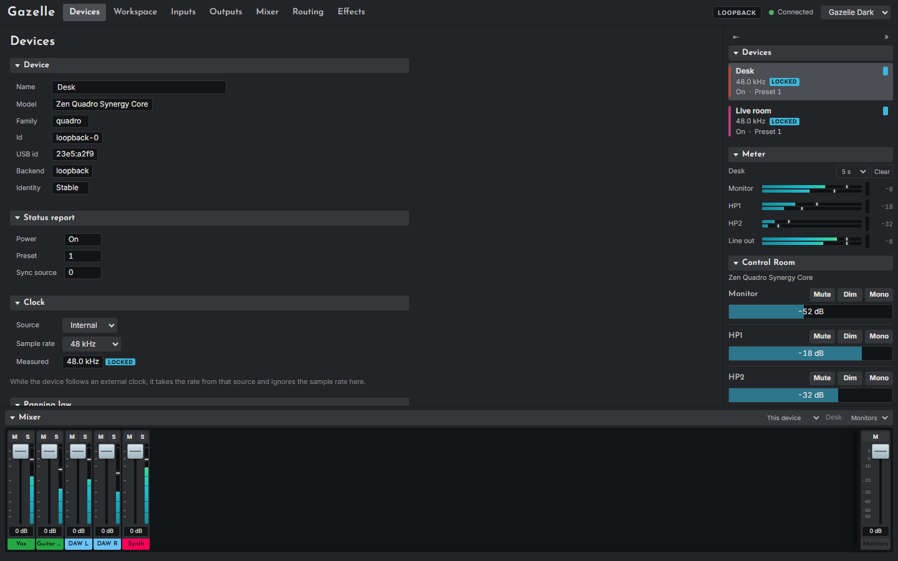

# Getting started

This chapter takes you from nothing to a first look at your interfaces. If you only want to see the app without hardware, skip to [Trying Gazelle without an interface](#trying-gazelle-without-an-interface).

## What you need

- **Windows 11, 64-bit.** Windows is the only platform Gazelle has been built and used on, and only Windows 11 has been tried; Windows 10 should work but is untested. The desktop window uses Microsoft's WebView2 runtime, which Windows 11 includes; without it Gazelle opens in your web browser instead.
- **A Zen Quadro Synergy Core or a Zen Studio+, or both**, connected over USB. Thunderbolt is not supported: Gazelle speaks to the devices over USB only.
- **Antelope's own software installed**, for the device's audio driver. Gazelle does not replace the driver; it replaces the control panels. Its background service has to be stopped while Gazelle runs (below).
- **No administrator rights.** Gazelle installs for your user account only.

## Get Gazelle

### From a release

> **Note.** No release has been published yet. Until one is, build from source (next section).

Each release on the project's GitHub page (https://github.com/doesdev/gazelle-audio/releases) carries a zip for Windows, `gazelle-audio-x86_64-pc-windows-msvc.zip`, holding two programs:

| File | What it is |
|---|---|
| `gazelle-audio-server.exe` | Gazelle with a console window, for the command line and for installing |
| `gazelle-audio-serverw.exe` | The same program with no console window: what the Start Menu shortcut runs |

Unzip it anywhere. The programs are **not code-signed**, so the first time you run one, Windows SmartScreen may say it "protected your PC". Choose **More info** and **Run anyway** only if you downloaded the zip from the project's own releases page.

To install it (recommended: it adds a Start Menu entry and lets the updater work), open a terminal in the unzipped folder and run:

```
gazelle-audio-server.exe --install
```

It copies both programs to `%LOCALAPPDATA%\Programs\Gazelle`, adds **Gazelle** to the Start Menu and to Settings, Apps, and asks whether to start it. After that you can delete the unzipped folder. Chapter 15, [Install, update and uninstall](15-install-update-uninstall.md), has the details.

You can also run Gazelle without installing it: double-click `gazelle-audio-serverw.exe`.

### From source

You need Rust 1.88 or newer (from https://rustup.rs), Node.js 24 or newer, and Git. From a clone of the repository:

```
corepack pnpm -C web install --frozen-lockfile
corepack pnpm -C web build
cargo build --release -p gazelle-audio-server --features window
```

The first two lines build the web interface, which the program embeds; skip them and the program serves a page saying the interface was not built. The third builds both programs into `target\release`. Without `--features window` you get the same program with no desktop window: it runs in the tray and opens in your browser.

## Stop Antelope's service

While Antelope's background service runs, it holds both interfaces for itself, and no other program can open them. Gazelle then finds no devices, shows a warning notice ("Antelope's Manager Service is running and holds the interfaces, so Gazelle cannot open them"), and the tray menu says **Warning: Antelope's service is holding the devices**.

Gazelle looks for the Windows service named `Antelope-Manager-Service`. To stop it:

- **With Services:** press Win+R, type `services.msc`, find the Antelope Manager service, and choose **Stop**. Set its startup type to **Manual** if you want it to stay stopped after a restart.
- **With PowerShell, as administrator:** `Stop-Service -Name Antelope-Manager-Service`

Gazelle never starts or stops the service itself; it only checks whether it is running. Once the service stops, Gazelle finds the interfaces within a few seconds, with no restart needed.

While the service is stopped, Antelope's own control panels cannot reach the devices. Audio keeps working: the driver is separate.

### Going back to the vendor's software

Quit Gazelle (right-click its tray icon, **Quit**), then start the service again (`Start-Service -Name Antelope-Manager-Service`, or **Start** in Services). Antelope's software works as before. Gazelle leaves the devices set as they were.

## The first run

Start Gazelle from the Start Menu, or by double-clicking `gazelle-audio-serverw.exe`. Three things appear:

- **The window**, showing the Devices page. Closing it only hides it; Gazelle keeps running.
- **A tray icon** in the notification area. Click it to show the window again; right-click it for the menu, including **Quit**.
- **Your interfaces** as cards in the sidebar on the right, each with its clock rate, lock state, power and preset.

Starting Gazelle a second time just brings the running window to the front.

> **Warning.** Opening a page reads your devices and changes nothing. Changing any control changes the device at once. Turn your monitors down before you start exploring; see [Safety](02-safety.md).

If no interface appears, see [No devices](16-troubleshooting.md#no-devices-appear).



## Trying Gazelle without an interface

Gazelle has a built-in emulator of one Quadro and one Studio+. It never touches hardware, which makes it the safe way to explore the app, and the way every screenshot in this manual was taken. From a terminal in the folder with the programs:

```
gazelle-audio-server.exe --backend loopback
```

Add `--loopback-cyclic-ms 100` to make the emulated devices report moving meters (every status value becomes a moving test pattern, so readouts such as the clock rate show nonsense), and `--no-persist` to keep your experiments out of your saved workspace. While another copy of Gazelle is running on the default address, use a different port as well, for example `--bind 127.0.0.1:8421`.

The header's badge says **LOOPBACK** while you are on the emulator, and **USB**, in the warning colour, when Gazelle is driving real interfaces.

## A first tour

The pages, left to right along the header:

| Page | For |
|---|---|
| [Devices](06-devices-page.md) | Name, clock and sample rate, presets, power, brightness, the test oscillator |
| [Workspace](12-workspace-page.md) | Everything that spans devices: names and colours, surfaces, cables, snapshots, backup |
| [Inputs](07-inputs-page.md) | Preamp type, gain, 48V and phase; digital input gains; microphone emulation |
| [Outputs](08-outputs-page.md) | Output volumes, mutes, dim, trims, hard mute and talkback |
| [Mixer](09-mixer-page.md) | The four internal mixes, as named channels with faders |
| [Routing](10-routing-page.md) | Which source feeds each output, recording channel and effect chain |
| [Effects](11-effects-page.md) | Effect chains, their settings, and the reverb |

Each page shows the device selected in the sidebar; click another device's card to switch. The sidebar also holds the output **Meter** and the **Control Room**, and the **Mixer** dock along the bottom keeps a mix's faders in reach on every page. Chapter 5, [The app](05-the-app.md), covers these and the gestures every control shares.
