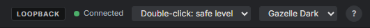
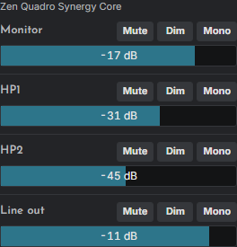
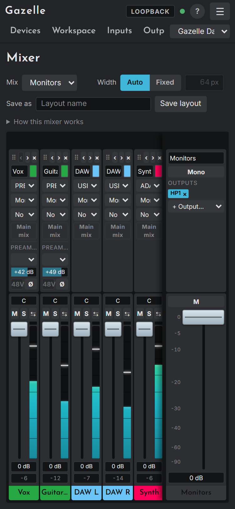

# The app

This chapter covers what surrounds the pages: the window and the tray, the header, the sidebar, the mixer dock, notices, themes, using Gazelle from a phone, and the gestures every control shares.

## The window and the tray

Gazelle is one program with three faces: a desktop window, a tray icon, and a small web server that both of them, and any browser you allow, talk to.

- **The window** shows the app. Closing it hides it; Gazelle keeps running in the tray, and your devices keep their settings. Its size and position are remembered.
- **The tray icon** (notification area) brings the window back with a click. Right-click it for the menu:

| Tray item | What it does |
|---|---|
| **Gazelle X.Y.Z** | The first line: which version is running. The icon's own tooltip stays **Gazelle** |
| **Open Gazelle** | Shows the window (or opens the browser, where there is no window) |
| **Open in browser** | Opens the same app in your web browser |
| Listening on, Backend, Dry run | Information: the address, `usb` or `loopback`, and whether dry run is on |
| Device lines | Each attached device, or **No devices attached** |
| **Warning: Antelope's service is holding the devices** | Shown while that service runs; see [Getting started](03-getting-started.md#stop-antelopes-service) |
| **Rescan devices** | Looks for interfaces again at once (it also does so every two seconds) |
| Update lines | The update state, **Check for updates**, and, when one is ready, **Restart to update to X**. **Download update X** appears only if you set `auto_download` to `false`; see [Updates](15-install-update-uninstall.md#updates) |
| **Start on boot** | Starts Gazelle, without a window, when you log in |
| **Open log folder** | Opens the folder with Gazelle's log files |
| **Quit** | Stops Gazelle. The devices keep their settings |

Starting Gazelle while it is already running brings the running window to the front instead of starting a second copy.

## The header

Along the top: the page tabs, then three things worth a glance.

- **The backend badge.** **USB** (in the warning colour) when Gazelle drives real interfaces; **LOOPBACK** when it runs the emulator.
- **Dry run**, shown only when Gazelle was started with `--dry-run`: commands report the bytes they would send, and nothing is written to a device.
- **The connection**: Connected, Reconnecting or Disconnected. While it is not connected, a banner says so and every control is disabled.

**Explain mode.** The **?** button turns it on and off, and it is remembered in this browser. While it is on, pointing at or tabbing to anything shows a small panel saying what it is, what changing it does and what to watch for; on a touch screen, the **i** button beside it makes the next taps explain instead of act. Nothing is sent to a device either way.

**The version.** While the explain mode is on, the version Gazelle is running reads out in dim text just left of the backend badge, so the number is to hand when you report something or ask about an update. It is out of the way the rest of the time, and a phone, whose header line is already full, leaves it out; the tray menu's first line says the same version.

**Updates.** Beside the version, and whether or not the explain mode is on, the header says what the updater wants, and nothing at all while there is nothing to want:

| What it shows | What it means | What pressing it does |
|---|---|---|
| nothing | Up to date, or checking, or this server has no updater | |
| **X downloading** | A new version is being fetched and checked | Nothing to press; wait |
| **X ready, restart** | It is downloaded, checked, and in place | Asks once more (**Confirm**), then restarts Gazelle into it. The devices are let go and picked up again, and the page reconnects by itself |
| **Get X** | A new version was found and this install does not fetch by itself (`auto_download` is `false`) | Downloads and checks it |
| **Update failed, try again** | A check or a download failed; its tooltip says why | Looks again |

A phone drops the version readout but keeps this, since it is something to do rather than something to read. The whole story is in [Updates](15-install-update-uninstall.md#updates).

At the right, two menus. **Double-click** chooses what a double-click does to a level: its **safe level** (the default: -20 dB on a fader, -30 dB on a volume, off on a reverb send), or **unity**. It is kept in this browser, and a phone, which has no double-click, does not show it. The **theme** menu switches between Gazelle Dark, Gazelle Light and any community or user themes.

## The sidebar

One sidebar holds three sections, each folded or opened by clicking its title. It sits on the right; the arrow button at its top moves it to the other side, and the double arrow folds it to a narrow rail.

- **Devices.** A card per interface: its name, the measured clock rate and **LOCKED** or **NO LOCK**, **On** or **Standby**, the current preset (Studio+ only), and a light that shows input signal (and turns to the clip colour briefly on a clip). Click a card to show that device on the current page.
- **Meter.** The shown device's outputs as level bars with a held peak and a clip light. The Quadro reports Monitor, HP1, HP2 and Line out; the Studio+ reports its output levels in a way Gazelle does not read yet, so it shows a note instead. **Clear** clears every clip light on every device; the menu beside it sets how long a clip light stays lit after the clip ends (2, 5, 10 or 30 seconds, or **Hold** until cleared). Clicking a single clip light clears it.
- **Control Room.** The outputs you monitor on, for the shown device: by default Monitor, HP1 and HP2; the **CR** button on the Outputs page adds or removes others. Each has a volume bar, **Mute**, **Dim** (Quadro) and **Mono**, and a caption saying what feeds it. On a Studio+, the talkback controls sit below: a **Talk** button you hold, the talkback level, and which of HP1, HP2 and Monitor it goes to.

**Mono** in the Control Room sums the mix that feeds the output to mono, by centring every channel's pan in that mix and lowering that mix by as much as summing gains (6 dB on the Studio+, less on the Quadro, where centre attenuation already takes some) so the level stays about the same; both are put back afterwards. Every output playing that mix goes mono too, and the button's tooltip names them. If more than one mix, or no mix, feeds the output, Mono is disabled and its tooltip says why. The first press may read the device's routing first, to find the mix.

## The mixer dock

The **Mixer** band along the bottom of every page (except the Mixer page itself) keeps one mix's faders in reach. It shows the selected device's channels in the selected mix as slim strips, with the mix master at the right.

- **Show** chooses **This device** or any [surface](13-surfaces-and-cables.md) you have built.
- The mix menu beside the device name is the same choice as the Mixer page's Mix buttons.
- Click the band's title to fold it away; Gazelle remembers.

## Notices and the "last sent" line

Failures and warnings appear as notices in the bottom-right corner, each closed with its ×. Examples: a command that failed, a workspace change the server refused (and that has been undone on screen), or Antelope's service holding the devices.

Every page that sends commands can show, at the right of its top bar, the last command it sent and its bytes, for example "Sent set_mixer: 70000000...". It appears while the explain mode is on, and in dry run, where it reads "Dry run, would send ..."; the rest of the time it stays out of the way.

## On a phone or a second computer

Gazelle is a web app served by the program on your computer, so any browser that can reach it gets the same controls. By default Gazelle listens only on the computer itself (`127.0.0.1:8420`). To use it from a phone on your network, start Gazelle with `--bind 0.0.0.0:8420` and open `http://<your computer's address>:8420` on the phone. Anyone who can reach that address can then change your levels, with no password; see [Safety](02-safety.md#other-hazards-worth-knowing).

At phone width the sidebar becomes a drawer, opened with the ☰ button and closed with Escape, a tap outside it, or by choosing a page. The mixer dock starts folded.

## Gestures

Every bar, fader and knob-like control in Gazelle responds to the same gestures.

| Gesture | What it does |
|---|---|
| **Drag** | Follows the pointer. A pan dragged near the centre snaps to centre |
| **Click** | Jumps straight to the value under the pointer |
| **Double-click** | Resets to the control's default (below) |
| **Ctrl+click** (Cmd+click) | On a level (faders, volumes, sends, returns): unity, wherever you click |
| **Mouse wheel** | One step per notch, up for more; pan steps through centre without snapping |
| **Arrow keys** | One step; Up and Right for more |
| **Page Up / Page Down** | A larger step (6 dB on faders, volumes and preamp gains) |
| **Home / End** | The control's two ends (see the warning below) |

What double-click resets to:

| Control | Reset |
|---|---|
| Mixer fader, mix master | -20 dB (Ctrl+click: 0 dB) |
| Pan | Centre |
| Studio+ reverb Send (Mixer page, mix 1) | off (Ctrl+click: 0 dB) |
| Output volume, Control Room volume, talkback level | -30 dB (Ctrl+click: 0 dB) |
| Preamp gain, digital input gain | 0 dB |
| Brightness | 50% |
| Reverb level | -18 dB, the nearest it has to -20 (Ctrl+click: 0 dB) |
| Quadro reverb returns | 20 steps below full (Ctrl+click: full) |
| Quadro reverb sends | off (Ctrl+click: 0 dB) |
| Effect settings | The vendor panel's starting value |

The rows with a Ctrl+click are **levels**. Their double-click goes to a safe level, and Ctrl+click to unity; with the header's **Double-click** menu on **unity**, double-click goes to unity as well. A level's tooltip says what its double-click and Ctrl+click do.

> **Warning.** Home and End go to the raw ends of a control's scale, which point different ways on different controls: on a mixer fader **Home is 0 dB**, while on an output volume **End is 0 dB**. Ctrl+click, and double-click when you have chosen unity, put a level at full level. With monitors up, prefer the arrow keys.

**Drop-down menus take the wheel too**, one option per notch, and most send their change at once. The clock source, sample rate, the driver's buffer size, **Add effect**, a channel's **Input** and **Main mix**, the mix master's **+ Output**, a surface's **Route** and mix pin menus, and the header's **Double-click** menu ignore the wheel, because one accidental notch there would interrupt audio, change routing or change a safety setting. Ctrl with the wheel still zooms the page.

**Text fields** (names) save on Enter or when you leave the field; Escape puts back what was there.

**Buttons that ask twice** read **Confirm** (or **Confirm N**, **Confirm save**, **Confirm standby**) after the first click, and forget it after three seconds: 48V on, a test tone on, DC coupling on, recalling or saving a device preset, the driver's Safe Mode either way, Standby, and removing a channel, a surface, a strip, a cable or a snapshot. Turning a thing off never asks, except Safe Mode, which restarts a DAW's audio either way. The clock source, sample rate and driver buffer size menus ask with a **Confirm** button beside them. Enter and Space press these buttons as a click does.

Apart from those, the only keyboard shortcuts are Escape (to close the phone drawer or a colour picker) and the usual Tab to move between controls.

## Where preferences are kept

| Kept in the workspace, for everyone using this Gazelle | Kept in this browser only |
|---|---|
| Device names and colours | Theme |
| Mixer channels, groups, mix names, links, saved layouts | Sidebar side, folded state and sections |
| Mono state of each mix | Mixer dock folded, and what it shows |
| Control Room output choices | Selected device, and the selected mix per device |
| Surfaces and digital cables | Mixer strip width |
| | Clip light auto-clear time |
| | What a double-click does to a level |

The window's own size and position are kept in `%APPDATA%\gazelle\window.json`.
