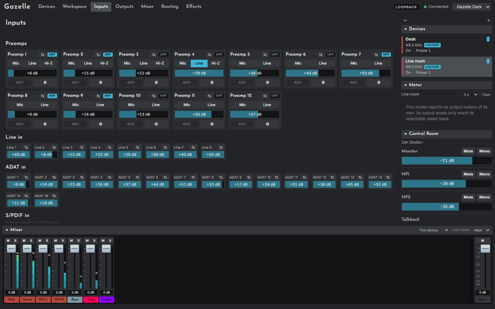
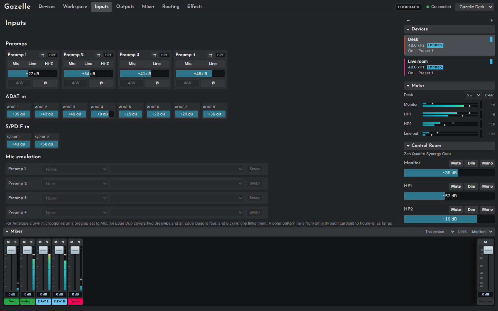

# The Inputs page

The Inputs page (`#/inputs`) sets the shown device's preamps and digital inputs. Until the device has sent its first status report, controls start at defaults and a note says so; they send only when you change them.

## Preamps

One card per preamp (4 on the Quadro, 12 on the Studio+):

| Control | What it does |
|---|---|
| **Mic / Line / Hi-Z** | The input type. Hi-Z (instrument) is offered on preamps 1 and 2 of the Quadro and 1 to 4 of the Studio+. The type sets the gain's range |
| **Gain** | Mic 0 to 65 dB, Line -6 to +20 dB, Hi-Z 0 to 40 dB. Double-click for 0 dB |
| **48V** | Phantom power, Mic type only. **Two clicks to switch on** (the button reads **Confirm**, or **Confirm N** when a link switches N preamps), or Ctrl+click. One click switches it off |
| **Ø** | Phase invert |
| **HPF** | Lit when the device reports its high-pass filter on. Read-only: neither model offers a command for it |
| **⇆** | Starts or opens a [link](09-mixer-page.md#links) |

## Digital inputs

The **Line in** (Studio+), **ADAT in** and **S/PDIF in** sections show each channel's gain, -6 to +12 dB.

- On the **Studio+** the gains are controls (double-click for 0 dB) and can be linked.
- On the **Quadro** they are shown read-only, with a tooltip saying why: the vendor's own Quadro panel never sets them, and nobody has checked that the device accepts it.

The Studio+'s S/PDIF sample rate converter is on the [Devices page](06-devices-page.md#clock).

## Microphone emulation (Quadro)

For Antelope's modelling microphones (the Edge range), each preamp row offers:

- **Microphone**: the microphone plugged in. Models your devices are not licensed for are greyed and say "(not licensed)".
- **Emulation**: the microphone to model, per capsule on a two-capsule microphone (Bottom and Top).
- **Polar pattern**, with a plot of the pattern chosen.
- **Stereo technique**, for a two-capsule microphone.
- **Swap**: exchanges the front and rear capsules.

A two-capsule microphone uses two preamps and a four-capsule one uses four; one row then covers them all. Emulation needs every preamp it uses set to **Mic**; Edge microphones need 48V on each of those preamps. Emulation was checked on a real Quadro with an Edge Duo; the Edge Quadro and preamps 3 and 4 have not been tried.
