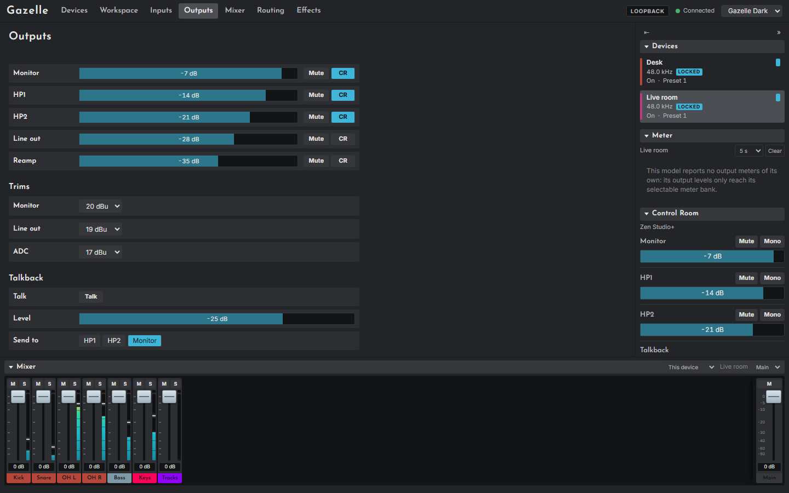

# The Outputs page

The Outputs page (`#/outputs`) sets the shown device's analogue outputs.

## Outputs

One row per output: Monitor, HP1, HP2 and Line out on both models, and Reamp on the Studio+.

| Control | What it does |
|---|---|
| **Volume** | From 0 dB (the loudest) down to -inf (silent), in 1 dB steps; Page Up and Page Down move 6 dB. Double-click for -30 dB |
| **Mute** | Mutes the output |
| **Dim** (Quadro) | Lowers the output by the device's dim amount |
| **CR** | Shows this output in the sidebar's [Control Room](05-the-app.md#the-sidebar). Saved in the workspace; sends nothing to the device |
| **MONO** (Quadro) | Lit when the device reports the output in mono. Read-only |

> **Warning.** 0 dB is the output's maximum. A click on the volume bar jumps to the point clicked, and End goes to 0 dB. See [Sudden level jumps](02-safety.md#sudden-level-jumps).

## Hard mute (Quadro)

**Hard mute**, at the top of the page, mutes every output of the Quadro at once, and a second press releases it. It is the quickest way to silence a Quadro from Gazelle. The Studio+ has no hard mute; mute its outputs one by one. Hard mute has not yet been tried on a real device.

## Trims

A trim sets an output's maximum level, from 20 dBu down to 14 dBu, to match what it feeds. The Quadro has Monitor and Line out trims; the Studio+ has Monitor, Line out and ADC.

## Talkback (Studio+)

- **Talk**: hold it down (with the mouse, or with Space or Enter) to talk; release to stop.
- **Level**: the talkback level. Double-click for -30 dB.
- **Send to**: which of HP1, HP2 and Monitor the talkback reaches.

The same controls are in the sidebar's Control Room. Talkback has not yet been tried on a real device.
