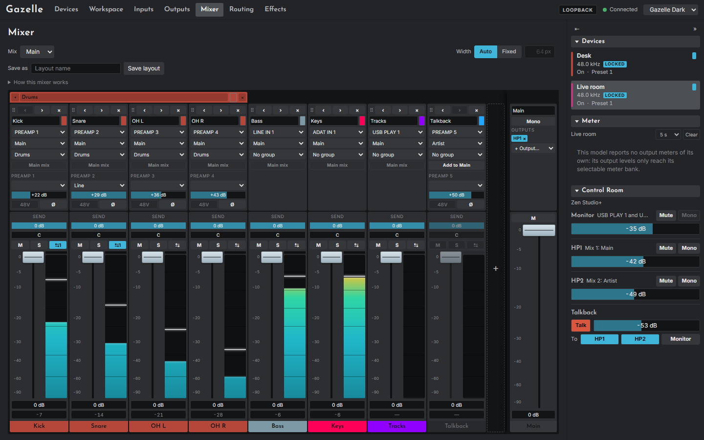

# The Mixer page

The Mixer page (`#/mixer`) shows one of the shown device's four mixes as a row of channel strips with the mix's master at the right. Every channel moves, meters and mutes in the mix chosen at the top.

## The top bar

- **Mix** chooses which of the four mixes the strips show. The choice is kept per device and in the page's address, so `#/mixer/<device>/1` opens mix 2.
- **Width**: **Auto** fits the strips to the window; **Fixed** sets a width in pixels.
- **How this mixer works** opens a short explanation.
- **Save as** saves the current channels, groups and mix names as a named **layout** that any device of the same model can start from.

A device with no channels yet offers **Start from**: starting layouts for the model (Tracking, Podcast or Playback on the Quadro; Tracking, Drums or Playback on the Studio+) and your saved ones. **Apply** replaces the channels and routes them. The first time the page opens for a device that has none, Gazelle builds channels from the device's existing routing.

## Channels

A channel is a named strip for one input. Its head, above the fader, holds:

| Control | What it does |
|---|---|
| **⠿**, **‹**, **›** | Drag, or move one place left or right. Dropping a channel between two members of a group joins the group |
| **×** | Removes the channel; click twice. Its routes into the mixer are muted |
| Name and colour swatch | The swatch opens colours to choose from, a custom colour, and **Clear** |
| **Input** | The source the channel carries. Changing it routes the source into the mixer at once |
| **Main mix** | The mix the channel belongs to |
| **Group** | A group to fold it into, or **New group...** |
| **Add to** / **In** | Sends the channel to the selected mix too, or takes it out |
| Preamp controls | For a preamp input: its type, gain, 48V (two clicks, the second on **Sure?**) and Ø, the same as the [Inputs page](07-inputs-page.md) |

A channel's colour comes from its group if the group has one, then its own, then its input's colour on the Routing page.

Below the head is the **strip**:

- **×2**, a badge shown only when the same audio reaches this mix twice. Its tooltip says how. See [Doubled signals](02-safety.md#doubled-signals).
- **Send** (Studio+, mix 1 only): the reverb send.
- **Pan**, shown as L 100%, C, R 100%. Dragging snaps to centre near the middle; the wheel and arrow keys step through it one value at a time. While the mix is in mono, the pan shows where it will return to.
- **M** (mute), **S** (solo), **⇆** (link).
- **The fader**, 0 dB at the top down to -90 dB, on an audio taper so the useful range has most of the travel. Double-click resets it to **0 dB**.
- **The meter** shows the channel's input before its fader: the signal arriving. It is shared by every channel on that input. A channel on an effect return is metered by the last effect in its chain, or, when the chain is empty, by the source feeding the chain; the tooltip says which. Some inputs report no meter, and say so.
- The level and peak readouts, and the name bar in the channel's colour.

A channel with no input or no main mix is greyed. A channel not in the selected mix has no meter.

The **+** after the last channel adds one. Each mix has 32 inputs; on the Quadro the first six carry the effect returns.

## The mix master

At the right of the row:

- the mix's **name** (type to rename it);
- **Mono**, which sums the mix to mono by centring every channel's pan, and restores the pans when turned off. It is the same Mono as the Control Room's;
- **Outputs**: where the mix plays, as chips. The chip's × stops the mix feeding that output at once; **+ Output...** adds one;
- the master fader and **M**.

## Groups

A group gathers channels under a band with a name, a colour and a fold button. A folded group shows as a narrow tile. The group's × removes the group and keeps its channels.

## Links

Links make a change to one channel follow on others, on the mixer or on the inputs, and even across devices.

1. Click a channel's **⇆** (on a strip, a preamp or a Studio+ digital input). A bar appears: **New link**.
2. Click the ⇆ of each channel to add or remove it. They can be on either device.
3. Choose **Same value** (every member gets the same value) or **Relative** (each keeps its offset).
4. **Save**. A linked badge reads ⇆1, ⇆2 and so on. Open it again to change the link or **Unlink** it.

Linked mixer strips follow each other's level, mute and solo; each keeps its own pan. Links live in Gazelle's workspace: Gazelle carries them out by sending each member its own change, which is how a link can span two devices.
