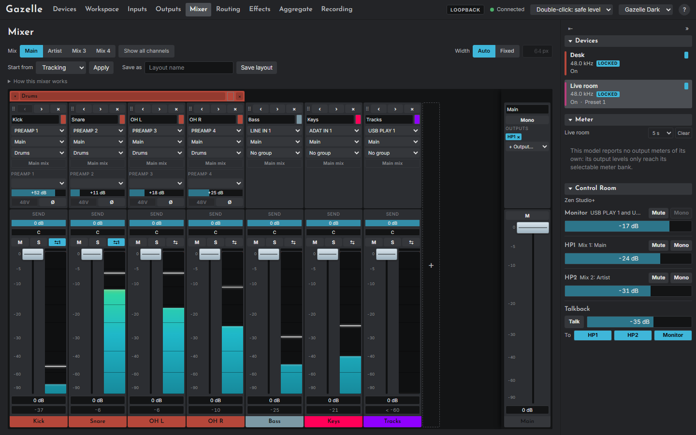
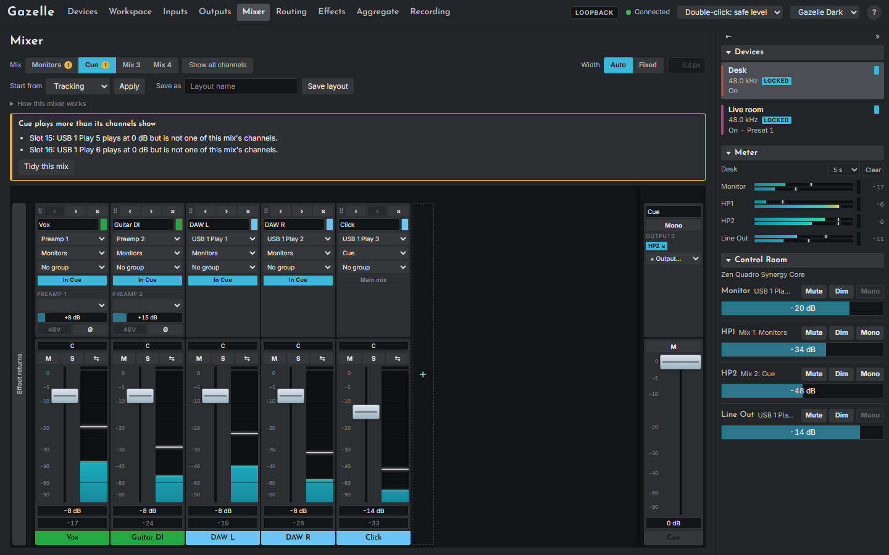
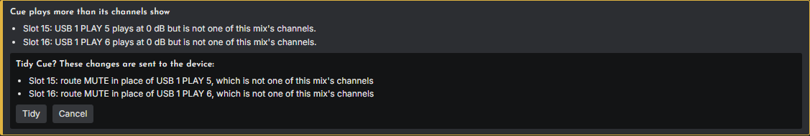
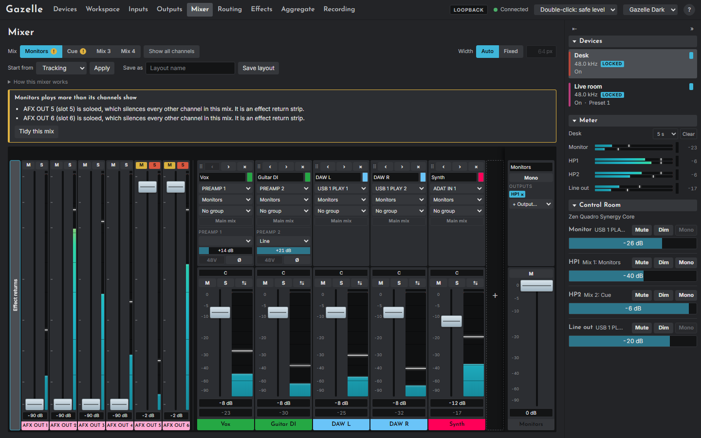

# The Mixer page

The Mixer page (`#/mixer`) is a view of **one mix** at a time: the channels routed to it, as a row of strips, with that mix's master at the right. A strip's fader is that channel's level **in the mix you have picked**, whether the mix is the channel's main mix or one it is sent to, and so are its pan, mute and solo. Each mix keeps its own balance, so riding one leaves the others alone.

## The top bar

- **Mix** is a row of buttons, one per mix, with exactly one active. Click one, or move between them with the arrow keys, Home and End. It ignores the mouse wheel, because one accidental notch would move every strip to another mix. The choice is kept per device and in the page's address, so `#/mixer/<device>/1` opens mix 2, and the mixer dock follows it. A mix marked **!** plays something its channels do not show; its tooltip counts what, and choosing it lists them (see [What a mix plays outside its channels](#what-a-mix-plays-outside-its-channels)). The dock's mix menu marks the same mixes with **(!)**.
- **Show all channels** shows every channel you have made, not only the ones in this mix. The ones outside it are dimmed, with no meter; their heads still work, so you can put one in the mix from there. Off, the page shows only what is routed to the mix, plus any channel that is not set up yet. The choice is remembered per device in this browser.
- **Width**: **Auto** fits the strips to the window; **Fixed** sets a width in pixels.
- **How this mixer works** opens a short explanation.
- **Save as** saves the current channels, groups and mix names as a named **layout** that any device of the same model can start from. Names are unique for each model: type a name already saved, in any case, and **Save layout** becomes **Replace**. Its first click reads **Confirm**, and a second within three seconds overwrites that layout in place, so it keeps its place in the list. Choosing a saved layout in **Start from** puts its name in the field, so saving replaces it; a new name you are typing is left alone. A workspace from before names were unique may hold two layouts of one name: the list shows the second as "Name (2)", so you can tell them apart, replace or delete either.
- **N channels soft-linked** appears once channels are selected for a [soft link](#soft-link), with **Clear**.

**Start from** offers the starting layouts for the model (Tracking, Podcast or Playback on the Quadro; Tracking, Drums or Playback on the Studio+) and your saved ones, whether or not channels are set up. **Apply** replaces the channels and routes them. With channels already set up it asks first: the first click reads **Confirm**, and a second within three seconds replaces them, so save the current ones as a layout before you switch if you want them back. A layout that would route the playback channel a [dedicated cable](#the-phase-cable) keeps asks first too, its tooltip saying why. The first time the page opens for a device that has none, Gazelle builds channels from the device's existing routing.

## Channels

A channel is a named strip for one input. Its head, above the fader, holds:

| Control | What it does |
|---|---|
| **⠿**, **‹**, **›** | Drag, or move one place left or right. Dropping a channel between two members of a group joins the group |
| **×** | Removes the channel; click twice. Its routes into the mixer are muted |
| Name and colour swatch | The swatch opens colours to choose from, a custom colour, and **Clear** |
| **Input** | The source the channel carries. Changing it routes the source into the mixer at once. Ignores the mouse wheel |
| **Main mix** | The mix the channel belongs to. A routing change too, so it ignores the mouse wheel |
| **Group** | A group to fold it into, or **New group...** |
| **Add to** / **In** | Sends the channel to the selected mix too, or takes it out. If that mix already has this channel's input on another channel, the button reads **Confirm** first and says what would be summed twice; a second click does it anyway |
| Preamp controls | For a preamp input: its type, gain, 48V (two clicks, the second on **Confirm**) and Ø, the same as the [Inputs page](07-inputs-page.md) |

A channel's colour comes from its group if the group has one, then its own, then its input's colour on the Routing page.

Below the head is the **strip**:

- **PHASE**, a badge shown only when the channel's input is the playback channel a [dedicated cable](#the-phase-cable) keeps for the phase measurement. Its tooltip names the cable.
- **×2**, a badge shown only when the same audio reaches this mix twice. Its tooltip says how. Gazelle also asks before it happens: choosing an **Input** or a **Main mix** that would put one input into a mix twice holds the change behind a **Confirm** button beside the menu, with the reason on it; press Confirm to do it anyway, or leave it and the menu goes back. Dry alongside the same signal through an effect chain is a parallel setup, not a doubling, and is not asked about. See [Doubled signals](02-safety.md#doubled-signals).
- **Send** (Studio+, mix 1 only): the reverb send, which is a different thing from being sent to another mix. Double-click turns it off, Ctrl+click puts it at 0 dB. There is no per-mix send control: the fader is the level in the mix you have picked, so pick the mix and use the fader.
- **Pan**, shown as L 100%, C, R 100%. Dragging snaps to centre near the middle; the wheel and arrow keys step through it one value at a time. While the mix is in mono, the pan shows where it will return to.
- **M** (mute), **S** (solo), **⇆** (link).
- **The fader**, this channel's level in the selected mix, 0 dB at the top down to -90 dB, on an audio taper so the useful range has most of the travel. Double-click resets it to **-20 dB**, and Ctrl+click (Cmd+click) puts it at **0 dB**, unity. The header's **Double-click** menu can make double-click unity instead.
- **The meter** shows the channel's input before its fader: the signal arriving. It is shared by every channel on that input. A channel on an effect return is metered by the last effect in its chain, or, when the chain is empty, by the source feeding the chain; the tooltip says which. Some inputs report no meter, and say so.
- The level and peak readouts, and the name bar in the channel's colour. Clicking the name bar selects the channel for a [soft link](#soft-link).

A channel with no input or no main mix is greyed, and stays on the row whichever mix is picked: it belongs to none of them yet, and it is the channel you are still making. A channel that belongs to another mix is hidden unless **Show all channels** is on, and is then dimmed and unmetered.

A mix with nothing routed to it says so, in the strip row, and says how to put something there.

The **+** after the last channel adds one. Each mix has 32 inputs; on the Quadro the first six carry the effect returns (see [Effect returns](#effect-returns-on-the-quadro)).

## The mix master

At the right of the row:

- the mix's **name** (type to rename it);
- **Mono**, which sums the mix to mono by centring every channel's pan and lowering the mix by as much as that gains (6 dB on the Studio+, less on the Quadro with its centre attenuation), so the level stays about the same; both are put back when it is turned off. It is the same Mono as the Control Room's;
- **Outputs**: where the mix plays, as chips. The chip's × stops the mix feeding that output at once; **+ Output...** adds one. An output on a [dedicated cable's](#the-phase-cable) path reads **(phase)** in the menu, and choosing it waits for **Confirm**;
- the master fader and **M**.

## What a mix plays outside its channels

The page shows the channels of your layout. The device keeps its own routing and strip settings besides, left there by the vendor's panel or by an older setup, and they still play even though no strip here shows them. Once a mix's routing and levels have been read from the device (so never in dry run), Gazelle looks for three things:

- **A strip playing outside this mix's channels.** A mix input that is routed, not muted and above -90 dB, on a slot none of this mix's channels uses: for example "Slot 7: USB 1 PLAY 3 plays at 0 dB but is not one of this mix's channels". It also catches a channel whose input on the device is not the one your layout gives it.
- **A solo.** A soloed strip silences every other channel of its mix, even when that strip is muted, and even when no strip here shows it: "AFX OUT 5 (slot 5) is soloed, which silences every other channel in this mix". Every solo in the mix is listed, shown or not.
- **Effect returns playing** (Quadro). These are listed on a line of their own and do not mark the mix, since you may well want them.

A mix with a stray or a solo gets a **!** on its Mix button, and the selected mix shows a notice above the channels listing each one by slot and source.

### Tidy this mix

**Tidy this mix** on the notice lists every change it would make, and makes none until you press **Tidy**:

- a strip on a slot none of this mix's channels uses has its route set to MUTE, the way Gazelle leaves a slot unused;
- a channel on the wrong input is routed to its layout input again, as applying the layout would;
- every solo in the mix is cleared, keeping each strip's level and mute.

Effect returns are left alone unless you tick **Also mute the effect returns**. The routing changes go to the device as one write for the mix, read fresh first, so routes made elsewhere in that mix are kept. Afterwards Gazelle reads the mix back from the device and says **Tidied: N changes**, and what is left, if anything. **Cancel** closes the list and changes nothing.

If a change it lists would route the playback channel a [dedicated cable](#the-phase-cable) keeps into the mix, the list says so first, in a box of its own; **Tidy** still makes it.

### Effect returns on the Quadro

On the Quadro, the first six inputs of every mix carry the effect returns, AFX OUT 1 to 6, as the vendor's panel keeps them. They are not channels of your layout, so the page shows them apart: slim strips before the channels, each with its fader, meter, **M** and **S**, sending the same commands as any strip. They appear by themselves while one of them is playing or soloed in the selected mix.

The **Effect returns** rail beside them shows or hides them by hand; that choice is remembered per device in this browser. The Studio+ has no fixed effect returns: an effect output there is a channel like any other, and one playing on a slot outside the mix's channels is listed as a stray.

## The phase cable

While a cable is [dedicated to phase and clock](16-surfaces-and-cables.md#dedicated-to-phase-and-clock), the Mixer guards its path as the [Routing page](10-routing-page.md#dedicated-cables) does. On the interface that sends it, one USB playback channel goes straight to the cable's digital output and nowhere else; on the other interface, one USB record channel records the cable.

- A channel whose input is the kept playback channel is marked **PHASE** on its strip, on this page and in the [mixer dock](05-the-app.md#the-mixer-dock). The **Input** menu reads **(phase)** after that channel, and so does **+ Output...** after the cable's output and after the record pair that holds the kept record channel.
- Anything that would put the kept playback channel into a mix, or send a mix to one of those outputs, waits for a **Confirm**, with the reason in its tooltip in the Routing page's words: choosing the channel as an **Input**, a **Main mix** or **Add to** for a channel on it, **+ Output...**, **Apply** for a layout with a channel on it, and a drop on the dock. Left alone, it goes back and nothing is sent.
- **Tidy this mix** lists it in its confirm, as above.

These changes are still allowed: confirm one and the Aggregate page says the phase path is broken and offers to put it back. To use those channels for something else, turn the dedication off on the Workspace page first.

## Groups

A group gathers channels under a band with a name, a colour and a fold button. A folded group shows as a narrow tile. The group's × removes the group and keeps its channels.

## Links

Links make a change to one channel follow on others, on the mixer or on the inputs, and even across devices.

1. Click a channel's **⇆** (on a strip, a preamp or a Studio+ digital input). A bar appears: **New link**.
2. Click the ⇆ of each channel to add or remove it. They can be on either device.
3. Choose **Same value** (every member gets the same value) or **Relative** (each keeps its offset).
4. **Save**. A linked badge reads ⇆1, ⇆2 and so on. Open it again to change the link or **Unlink** it.

Linked mixer strips follow each other's level, mute and solo; each keeps its own pan. Links live in Gazelle's workspace: Gazelle carries them out by sending each member its own change, which is how a link can span two devices.

## Soft link

A soft link makes several channels move together for a while, like Cubase's Q-Link, without making a link you have to undo.

1. Click a channel's **name bar**, at the foot of its strip, to select it. **Ctrl+click** (Cmd+click) adds or removes a channel, and **Shift+click** selects every channel between the last one clicked and this one. On a touch screen a tap adds or removes a channel; swiping along the row still scrolls it. Selected strips are outlined in the accent colour.
2. With two or more selected, the bar at the top reads **N channels soft-linked**. Moving the fader or the pan of any of them moves the others by the same step, keeping the differences between them; a channel that reaches the top or bottom of its range stops there while the rest carry on. Clicking **M** or **S** on one sets the others to the same state.
3. **Clear**, or Escape, ends it. So does a plain click on the only channel still selected.

A soft link acts in the mix you are working in, on the channels of one device: a selected channel that is not in that mix is left alone, and selecting a channel on another device starts a new selection there. It works the same way in the mixer dock, but not on the Remote page or on a surface. Each channel is sent the same command its own control would send. A channel that is also in a saved link moves once, not twice, and that link's other members follow it as they always do. A soft link is never saved in the workspace and never sent to the device: reloading the page ends it.
