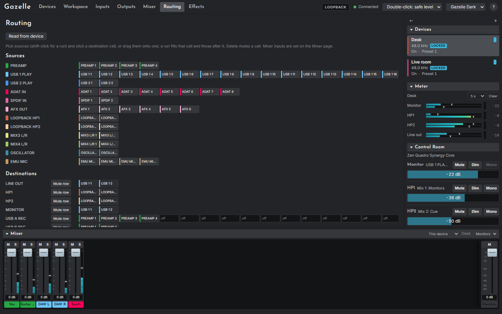

# The Routing page

The Routing page (`#/routing`) is the device's routing matrix: which source feeds each channel of each destination.

## Reading it

- **Sources** are grouped as the device groups them (PREAMP, USB PLAY, ADAT IN, AFX OUT, the mixes' outputs and so on), each group in its own colour.
- **Destinations** are one row per group: the analogue outputs, the recording channels, the digital outputs, the effect chain inputs (AFX IN) and the mixer inputs. Each cell shows its source's short name, a dash when muted, or **?** before it has been read. Hovering shows the full route, for example "HP1 1 ← PREAMP 3".
- The mixer input rows are read-only here: channels on the [Mixer page](09-mixer-page.md) set them.

## Changing routes

1. Click a source to select it; Shift-click another in the same group to select a run of them.
2. Click a destination cell, or drag the selected sources onto it. A run fills that cell and the ones after it, up to the end of the row.

Or select a cell and press Delete (or Backspace) to mute it. **Mute row** mutes a whole destination. Each change is sent at once, one destination group at a time; Gazelle reads the group from the device again before writing, so routes made elsewhere are kept.

> **Warning.** A source routed straight to an output plays at its full level, with no fader in the way, and routing an output back into an input can make a feedback loop. Change routing with monitors low. See [Safety](02-safety.md#feedback-loops).

**Read from device** reads every destination again, for when something else may have changed the routing.

## Adding sources to a mix

To build a mix from here, drag sources down onto the [mixer dock](05-the-app.md#the-mixer-dock) at the bottom of the page. Each source you drop becomes a new channel in the mix the dock shows, fed by that source, exactly as if you had pressed **+** on the [Mixer page](09-mixer-page.md) and chosen its **Input** and **Main mix**: Gazelle routes it into that mix the same way. A run of selected sources adds one channel for each.

- While you drag over the dock it is outlined and says what the drop will do, for example "Drop to add a channel to Monitors".
- The dock adds only to the device the sources belong to. While it shows a surface (its **Show** menu) it refuses the drop and says why; set **Show** to **This device** first.
- If the mix already has one of those inputs, nothing is added straight away: the dock asks first, as the Mixer page does (see [Doubled signals](02-safety.md#doubled-signals)). Press **Confirm** to add anyway, or **Cancel**; left alone for a few seconds, the question goes away and nothing is added.
- Held over a folded dock, the drag opens it after a moment.
- A device with no mixer layout yet first takes the one its routing gives, as opening the Mixer page would, so the new channels join the ones already there.

Dragging to the dock needs a mouse. On a touch screen, chips drag onto destination cells only; add channels on the Mixer page instead.
