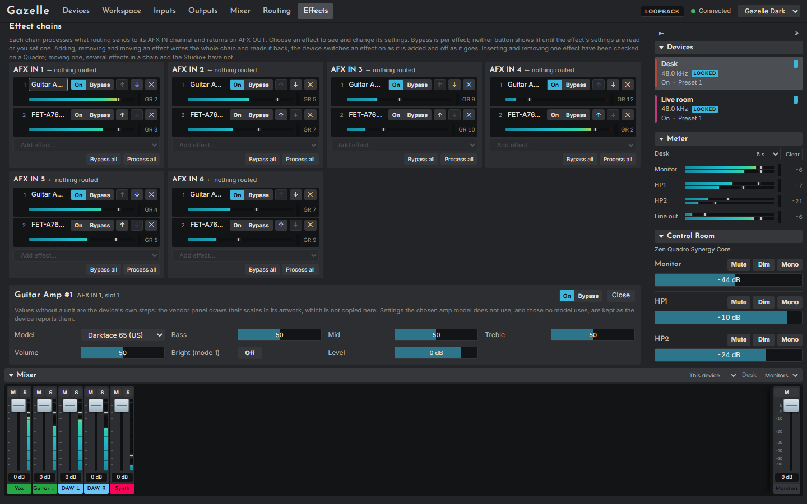
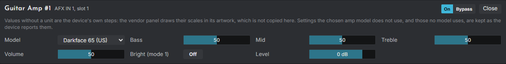

# The Effects page

The Effects page (`#/effects`) shows the shown device's effect chains and its reverb. Read [Effects and reverb](04-concepts.md#effects-and-reverb) first if chains are new to you.

> **Note.** Inserting and removing one effect on a Quadro, and one Guitar Amp setting, are the only effect changes tried on a real device. Reordering, chains of several effects, the Studio+'s chains, every other effect setting and the reverb controls have been tested against the emulator only. Turn monitors down first.

## Chains

One card per chain (**AFX IN 1** to **6** on the Quadro, **1** to **16** on the Studio+), headed with its number, **LINK** when it is linked to its neighbour, and the source routed into it. Each effect in the chain has a row:

- its position, name and instance ("Guitar Amp #1"): click the name to open or close its settings;
- a meter with a clip light, and **GR** with the gain reduction in the device's own steps;
- **On** and **Bypass**. Neither is lit until the effect's state has been read or set;
- **↑** and **↓** to move it (their tooltip says moving has never been tried on a device), and **✕** to remove it, at once.

**Add effect...** adds an effect of the chosen type at the end of the chain. Types with no free instance left are greyed, with the count in the tooltip. **Bypass all** and **Process all** act on the whole chain.

Adding, removing and moving each rewrite the whole chain and then read it back, so what you see is what the device made of it. A change to one chain of a linked pair is made to its partner too.

**Read from device** reads everything again.

## Effect settings

Clicking an effect's name opens its settings below the chains: a control per setting (a bar, a switch, a menu or a row of buttons), and its own **On** and **Bypass**.

- Nothing is sent until the effect's current settings have been read from the device.
- Values without a unit are the device's own steps: the vendor panel draws its scales in artwork that Gazelle does not copy.
- **Double-click** a setting to reset it to the vendor panel's starting value.
- The **Guitar Amp** shows only the knobs and switches its chosen model has. Settings the model does not use are kept as the device reported them.
- The Studio+ **Equalizer** is shown band by band; choosing a high-pass or low-pass filter for a band sets its gain to 0 and greys it.
- A few effects cannot be edited here (the Quadro's ClearQ, Auto-Tune and Instinct, and Guitar Cabinet on both models); they say why.

## Reverb

- **On** switches the reverb on and off; **Level** sets its level (double-click for -18 dB, the nearest it has to -20 dB; Ctrl+click for 0 dB).
- Its other settings (room size, reverb time, pre-delay and so on) are shown read-only; changing them is not in this version.
- **Quadro:** **Reverb returns** set how much reverb reaches mix 1 (Monitor and HP1) and mix 2 (HP2), each with a Mute; double-click puts a level 20 steps below full (about -20 dB, if the steps are decibels), and Ctrl+click at full. **Reverb sends** set how much of each of mix 1's channels 1 to 16 goes to the reverb, with a pan; double-click a send for -20 dB, Ctrl+click for 0 dB.
- **Studio+:** each channel's reverb send is its **Send** on the Mixer page, in mix 1; the return is the reverb level.
