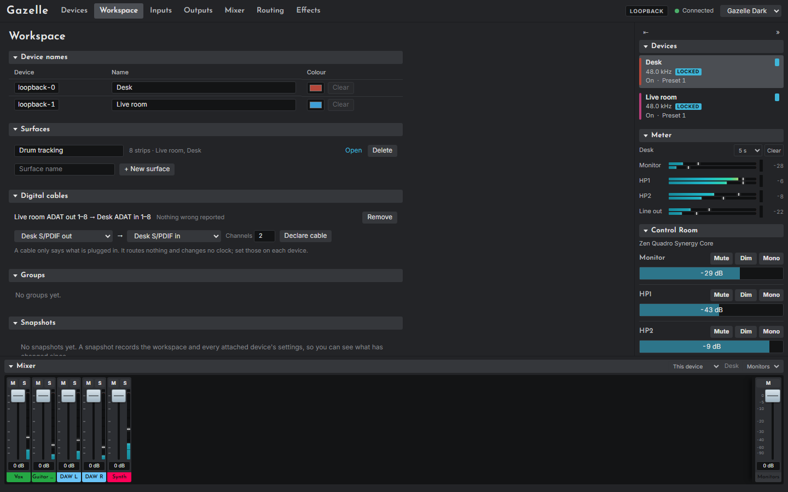

# The Workspace page

The Workspace page (`#/workspace`) holds everything that spans devices. Nothing on it changes a device, except what a surface's own controls do once you open it. Edits save by themselves ("Saving..." shows in the section's bar) and are shared by every browser using this Gazelle.

## Device names

A row per device: its name (the same as on the Devices page) and a **colour**, used for the device's badge on surface strips. **Clear** goes back to the theme's colour.

## Surfaces

Each surface is listed with its strip count and devices, a name you can edit in place, **Open**, and **Delete** (click twice). Type a name and choose **+ New surface** to make one. Chapter 13, [Surfaces and digital cables](13-surfaces-and-cables.md), covers building one.

## Digital cables

Declared connections between two devices' digital ports, each with a health line ("Nothing wrong reported", or a warning) and **Remove** (click twice). To declare one, choose the sending port (**From**), the receiving port of the same kind (**To**), how many **Channels**, and **Declare cable**. A cable routes nothing and changes no clock. See [Digital cables](13-surfaces-and-cables.md#digital-cables).

## Groups

The top-level channel groups, with their colours, folded or opened.

## Snapshots and backup

Taking, comparing and previewing snapshots, and exporting and importing the workspace, are in chapter 14, [Snapshots and backup](14-snapshots-and-backup.md).
