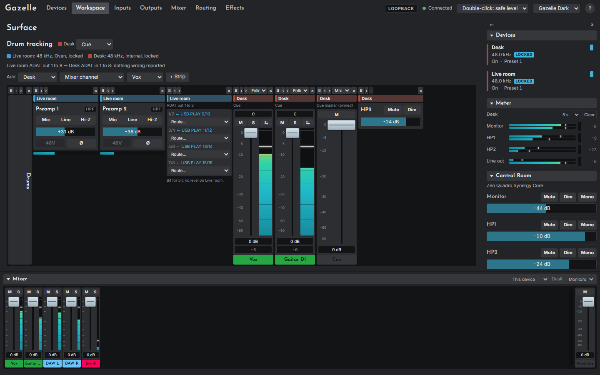

# Surfaces and digital cables

## Surfaces

A surface is a row of strips you build from any attached devices, opened from the Workspace page at `#/surface/<id>`. It is for work that crosses devices: say, a Studio+'s drum preamps next to the Quadro's cue mix that the drummer hears.

Every strip has a badge in its device's colour and name. Every control on a strip sends exactly what the same control sends on its device's own page, to that device, and nothing else: a surface never routes anything by itself, and one device's mix never pretends to contain another's channels.

### The top bar

- The surface's name, and one **mix** menu per device that has channel or master strips on it. A surface keeps its own choice of mix per device, separate from the Mixer page.
- A clock line per device: rate, source and lock.
- A health line per digital cable between devices on the surface.

### Adding strips

Choose a device, a kind of strip, the item, and **+ Strip**:

| Kind | What the strip holds |
|---|---|
| **Mixer channel** | A Mixer page channel, in the surface's mix for that device, or pinned to one mix |
| **Mix master** | A mix's master fader and mute |
| **Input** | A preamp's card, or a digital input's gain, with a level bar |
| **Output** | An output's volume, mute and dim |
| **Digital out** | An S/PDIF or ADAT output: what feeds each pair, and a **Route...** menu |
| **Both ends of a cable** | The sending port and the receiving inputs, side by side |
| **Label** | A heading, or a gap when left empty |

Each strip has a grip to drag it, **‹ ›** to move it, a mix pin menu on channels and masters, and **×** to take it off the surface (click twice).

### Linking from a surface

Channel and input strips carry the same link badge as the Mixer and Inputs pages, and the link bar
appears here too, so a pair that spans two devices can be made where you can see both. Pick one
strip's badge, then another's, choose **Same value** or **Relative**, and **Save**. The bar names
every member with its device, since a surface spans devices. Links are the workspace's own, so one
made here is the same link the Mixer shows.

### Digital out strips

Digital outputs have no level of their own on either model. A port strip shows what feeds each pair: a mix by name (with that mix's master strip beside it, as the level control), a source ("Bit for bit: no level on <device>"), or Muted.

Its **Route...** menu changes that routing on the device that owns the port, at once: a mix, a pair of sources bit for bit, or Mute. It ignores the mouse wheel.

## Digital cables

A cable tells Gazelle that one device's S/PDIF or ADAT output is connected to another's input of the same kind. Declare them on the [Workspace page](12-workspace-page.md#digital-cables). With a cable declared, Gazelle:

- labels a channel or input fed by it with where the signal comes from, for example "from Live room ADAT out 1", and, once the sender's routing is read, which source or mix it carries;
- warns when the two devices' sample rates differ, when the receiver is not locked to its clock, and when signal leaves the sender but none arrives ("check the cable, the routing and the clock").

Cables change nothing on the devices. Switching clocks stays on the Devices page. Surfaces and cables have been tested against the emulator only.
