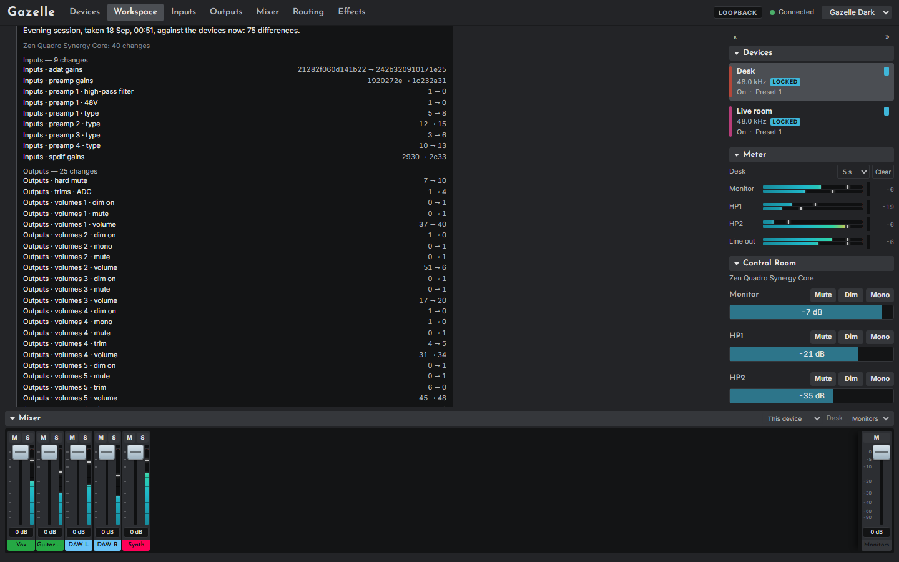
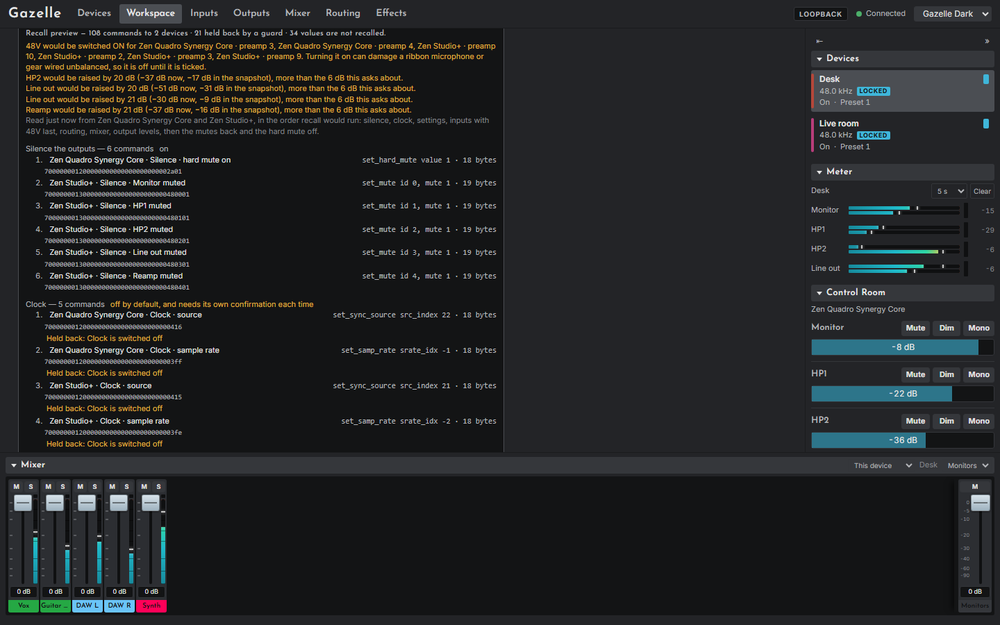

# Snapshots and backup

Both live on the [Workspace page](12-workspace-page.md).

## Snapshots

A snapshot records, under a name and the time, the workspace and everything Gazelle can read from every attached device: all four mixes, every routing group, preamps and input gains, microphone emulation, output volumes, mutes and trims, the clock, and device settings such as the panning law and brightness. It notes the current preset slot but not what is in it. It does not record the test oscillator, power, meters, effects or the reverb.

- **Take snapshot** with a name. Gazelle reads every device fresh; it takes a moment ("Reading the devices...").
- Rename a snapshot in place, or **Delete** it (click twice).
- A value a device would not give up is recorded as unread, never guessed.
- A snapshot cannot be taken in dry run, which reads nothing from the devices.

Snapshots are stored one file each in `%APPDATA%\gazelle\snapshots`.

## Comparing with now

**Compare with now** reads the devices again and lists every difference, grouped by device and section, with the snapshot's value and the value now, such as "Inputs · preamp 3 · 48V" going from 0 to 1. A value that could not be read on either side is listed as unknown, never as the same. A device in the snapshot that is not attached now is named as missing.

## What recall will do

Putting a snapshot back on the devices is **not built**. It would change dozens of things at once on equipment connected to speakers, headphones and microphones, and it waits for a session of careful checks on real hardware. What is built is the plan, which you can preview: **Prepare recall**, under a comparison, shows exactly what recall would send, in order, with the bytes of each command, and ends with "Nothing has been sent to any device".

The plan is designed to be safe to run once apply exists:

1. **Silence first.** Hard mute on a Quadro; every output muted on a Studio+. If the snapshot cannot supply the mutes to put back, nothing for that device runs at all.
2. **The clock** (off unless chosen, and confirmed every time).
3. **Device settings and DC coupling** (off unless chosen; DC coupling confirmed every time).
4. **Inputs**: 48V switched off first, then type before gain, then phase and emulation.
5. **48V on last among the inputs**, while still silenced, and only if ticked every time.
6. **Routing**, one group at a time; then **the mixer, quieter changes first**; then output levels and trims.
7. **Restore** the mutes, and the hard mute last.

Any output that would be raised by more than **6 dB**, or whose level now is unknown, needs its own tick. Values that could not be read on either side are never sent. Stereo link flags and a few values whose meaning is not yet certain are held back and listed with the reason.

Behind the page, the server refuses to apply a snapshot unless it was started with `--enable-recall` **and** the request asks for it too; even then, the sending loop is not written.

## Backup

- **Export** downloads the workspace as `gazelle-workspace-YYYY-MM-DD.json`.
- **Export with snapshots** downloads `gazelle-backup-YYYY-MM-DD.json`, holding the workspace and every snapshot.
- **Import...** reads either kind of file and asks first, inline, saying what the file holds and which of its devices are not attached. **Replace workspace** replaces the whole workspace, for everyone using this Gazelle, and adds the file's snapshots that are not already here (a snapshot already here is kept, never replaced). **Cancel** changes nothing.

Import never sends anything to a device. Export first if you may want the current workspace back.
