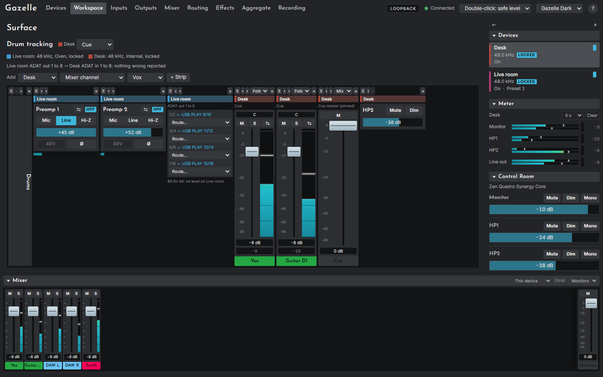

# Surfaces and digital cables

## Surfaces

A surface is a row of strips you build from any attached devices, opened from the Workspace page at `#/surface/<id>`. It is for work that crosses devices: say, a Studio+'s drum preamps next to the Quadro's cue mix that the drummer hears.

Every strip has a badge in its device's colour and name. Every control on a strip sends exactly what the same control sends on its device's own page, to that device, and nothing else: a surface never routes anything by itself, and one device's mix never pretends to contain another's channels.

### The top bar

- The surface's name, and one **mix** menu per device that has channel or master strips on it. A surface keeps its own choice of mix per device, separate from the Mixer page.
- A clock line per device: rate, source and lock.
- A health line per digital cable between devices on the surface.

### Adding strips

Choose a device, a kind of strip, the item, and **+ Strip**:

| Kind | What the strip holds |
|---|---|
| **Mixer channel** | A Mixer page channel, in the surface's mix for that device, or pinned to one mix |
| **Mix master** | A mix's master fader and mute |
| **Input** | A preamp's card, or a digital input's gain, with a level bar |
| **Output** | An output's volume, mute and dim |
| **Digital out** | An S/PDIF or ADAT output: what feeds each pair, and a **Route...** menu |
| **Both ends of a cable** | The sending port and the receiving inputs, side by side |
| **Label** | A heading, or a gap when left empty |

Each strip has a grip to drag it, **‹ ›** to move it, a mix pin menu on channels and masters, and **×** to take it off the surface (click twice).

### Linking from a surface

Channel and input strips carry the same link badge as the Mixer and Inputs pages, and the link bar
appears here too, so a pair that spans two devices can be made where you can see both. Pick one
strip's badge, then another's, choose **Same value** or **Relative**, and **Save**. The bar names
every member with its device, since a surface spans devices. Links are the workspace's own, so one
made here is the same link the Mixer shows.

### Digital out strips

Digital outputs have no level of their own on either model. A port strip shows what feeds each pair: a mix by name (with that mix's master strip beside it, as the level control), a source ("Bit for bit: no level on <device>"), or Muted.

Its **Route...** menu changes that routing on the device that owns the port, at once: a mix, a pair of sources bit for bit, or Mute. It ignores the mouse wheel.

## Digital cables

A cable tells Gazelle that one device's S/PDIF or ADAT output is connected to another's input of the same kind. Declare them on the [Workspace page](12-workspace-page.md#digital-cables). With a cable declared, Gazelle:

- labels a channel or input fed by it with where the signal comes from, for example "from Live room ADAT out 1", and, once the sender's routing is read, which source or mix it carries;
- warns when the two devices' sample rates differ, when the receiver is not locked to its clock, and when signal leaves the sender but none arrives ("check the cable, the routing and the clock"). A cable into an S/PDIF input whose **Converter** is on is not warned about on either count: the rate is converted, and that device need not follow the sender's clock. Signal that never arrives is still reported.

Declaring a cable changes nothing on the devices. Switching clocks stays on the Devices page. Surfaces and cables have been tested against the emulator only.

### Dedicated to phase and clock

A digital cable from the aggregate's callback master to another interface of the aggregate can be given over to the [phase measurement](13-aggregate-page.md#the-phase) and the clock, so it carries nothing else and nothing else takes its channels. Each cable on the [Workspace page](12-workspace-page.md#digital-cables) has **Dedicate to phase and clock**. It is offered only for such a cable, with both interfaces connected; otherwise it is greyed, with the reason beside it: the cable runs into the callback master, an interface is not in the aggregate, or another cable into that interface is dedicated already.

Pressing it reads the routing it needs, then lists every change in a confirm before anything is written:

- **On the callback master**, a USB playback channel nothing uses (no destination takes it and it is in no mix; the highest numbered one, such as **USB 1 PLAY 16**) is routed straight to the cable's first channel, **S/PDIF out L**. On S/PDIF the other side, **S/PDIF out R**, is muted, so the cable carries the measurement and nothing else. S/PDIF carries its clock whatever it plays, so muting it costs the clock nothing. On ADAT the other channels are left as they are.
- **On the other interface**, a USB record channel records the cable's first channel, **S/PDIF in L**: one that already does, else the highest one that records nothing.
- **In the aggregate's setup**, that interface's **Phase setup** names the two channels. A phase reference measured over another path is taken out, since it would line every session up to a state the new path was never in: measure the interfaces again under **Line the interfaces up** to give it one.
- The two channels are then kept for the measurement and hidden from your DAW, and the ones the old phase setup named come back to it.

**Write it and dedicate** writes each routing group once, read from the interface first, as the Routing page does. If the path is there already, nothing is written. The clock is not touched here: if the other interface is not clocked from the cable, **Put Studio+ on S/PDIF** (with its name) appears beside the cable, and asks twice, because a clock change interrupts the audio.

While it is dedicated:

- the cable's row says what it keeps: **Dedicated to phase and clock: Quadro USB 1 PLAY 16 → S/PDIF out L → Studio+ USB REC 21**;
- the [Routing page](10-routing-page.md#dedicated-cables) marks those channels **PHASE**, and asks before a change that would break the path;
- the [Mixer page](09-mixer-page.md#the-phase-cable) and the mixer dock mark a channel on the kept playback channel **PHASE** and the cable's output **(phase)**, and ask before a channel, a mix, a layout or a drop would break the path;
- the Aggregate page's **Ready to use** says when the path is broken, and **Put the phase path back** restores it.

A dedication means something only while its cable leaves the callback master and the other interface's phase setup names its two channels. Choose another callback master, take an interface out of the aggregate, or change the phase setup, and the row and the Aggregate page say the dedication means nothing now: its routing stays as it was and nothing guards it.

**Turn off** writes nothing to the interfaces. **Turn off, keep the phase setup** leaves the routing and the phase setup as they are, so the phase is still measured over the same channels and they stay hidden from your DAW; only the guard goes. **Turn off and clear the phase setup** also clears the other interface's phase setup, which gives both channels back to your DAW and stops the measurement. Removing a dedicated cable removes its dedication with it.
